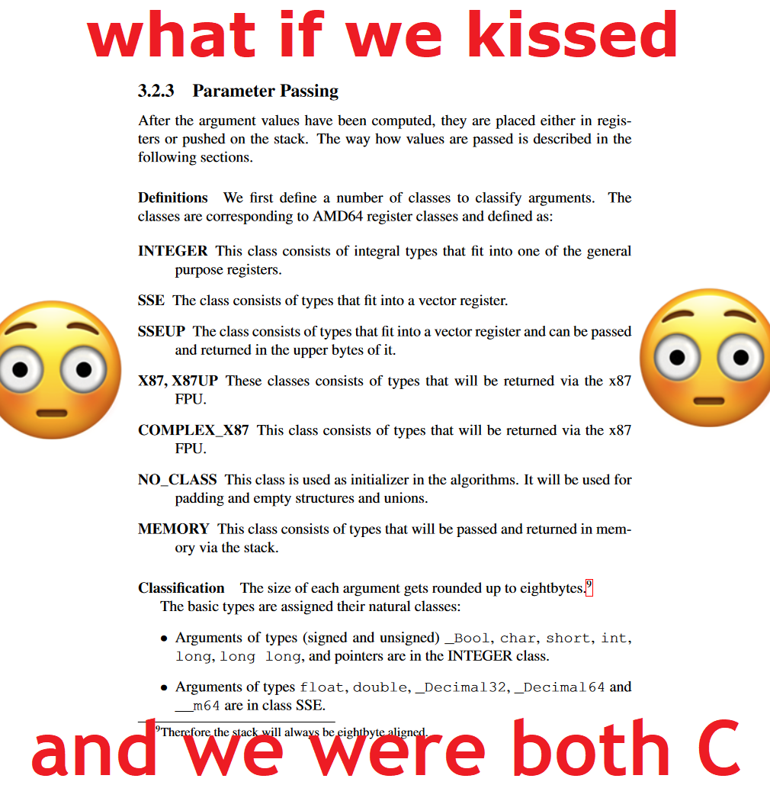
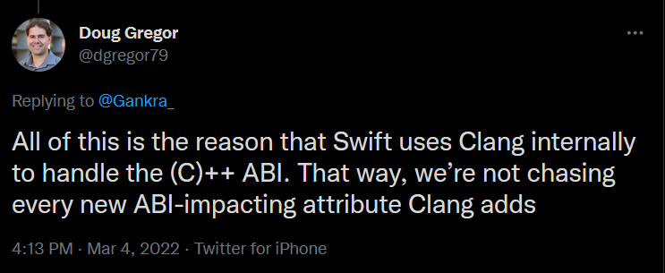

% C Isn't A Programming Language Anymore

<header>
    <p class="author">Aria Beingessner</p>
    <p class="date">March 16th, 2022</p>
</header>

Phantomderp and I have both recently been very aligned on a particular subject: [being extremely angry about C ABIs](https://thephd.dev/to-save-c-we-must-save-abi-fixing-c-function-abi) and [trying to fix them](https://github.com/rust-lang/rust/issues/54341). Where we're not aligned is *why* we're mad about them.

He's trying to materially improve the conditions of using C itself as a programming language.

I'm trying to materially improve the conditions of using literally any language other than C.

Now you might reasonably ask: "what the fuck does your problem have to do with C?"

It wouldn't if C was actually a programming language. Unfortunately, it's not, and it hasn't been for a long time. This isn't about the fact that C is actually horribly ill-defined [due to a billion implementations](https://thephd.dev/your-c-compiler-and-standard-library-will-not-help-you) or its [completely failed](https://thephd.dev/intmax_t-hell-c++-c) [integer hierarchy](https://gankra.github.io/blah/rust-layouts-and-abis/#the-c-integer-hierarchy).

That stuff sucks, but on its own that wouldn't be *my* problem.

*My* problem is that C was elevated to a role of prestige and power, its reign so absolute and eternal that it has completely distorted the way we speak to each other. Rust and Swift cannot simply speak their native and comfortable tongues -- they must instead wrap themselves in a grotesque simulacra of C's skin and make their flesh undulate in the same ways it does.

C is the *lingua franca* of programming. We must all speak C, and therefore C is not just a programming language anymore -- it's a protocol that every general-purpose programming language needs to speak. 

So actually this kinda *is* about the whole "C is an inscrutable implementation-defined mess" thing. But only insofar as it makes this protocol we all have to use an even bigger nightmare!


# Foreign Function Interfaces

Ok let's get technical. You've finished designing your new language, Bappyscript, with first class support for Bappy Paws/Hooves/Fins. An amazing language that's going to completely revolutionize the way that cats, sheep, and sharks program!

But now you need to actually make it do something useful. You know like, take user input, or write output, or literally anything observable? If you want programs written in your language to be good little citizens that work well with the major operating systems, you need to interact with the operating system's interface. I hear that everything on Linux is "just a file", so let's open a file on Linux!

*googles*

```C
OPEN(2)

NAME
       open, openat, creat - open and possibly create a file

SYNOPSIS

       #include <fcntl.h>

       int open(const char *pathname, int flags);
       int open(const char *pathname, int flags, mode_t mode);

       int creat(const char *pathname, mode_t mode);

       int openat(int dirfd, const char *pathname, int flags);
       int openat(int dirfd, const char *pathname, int flags, mode_t mode);

       /* Documented separately, in openat2(2): */
       int openat2(int dirfd, const char *pathname,
                   const struct open_how *how, size_t size);

   Feature Test Macro Requirements for glibc (see
   feature_test_macros(7)):

       openat():
           Since glibc 2.10:
               _POSIX_C_SOURCE >= 200809L
           Before glibc 2.10:
               _ATFILE_SOURCE
```

Um sorry what? This is Bappyscript, not *C*. Where's the Bappyscript interface for Linux?

*googles*

What do you *mean* there's no Bappyscript interface for Linux!? Ok well sure it's a brand-new language, but you're going to add one, right? Right...?

Fuck ok, I guess we have to use what they've given us.

We're going to need some kind of Interface that lets our language call Functions that are Foreign to it. A Foreign Function Interface... FFI... yeah! I like the sound of that!

Oh hey there Rust, you have C FFI too? And you too Swift? Even Python?!



Everyone had to learn to speak C to talk to the major operating systems, and then when it came time to talk to *eachother* we suddenly all already spoke C so... why not talk to eachother in terms of C too?

Oops! Now C is the *lingua franca* of programming.

Oops! Now C isn't just a programming language, it's a *protocol*.


# What Does Talking To C Involve?

Ok so apparently basically every language has to learn to talk C. A language that is definitely very well-defined and not a mass hallucination.

What does "talking" C mean? It means getting descriptions of an interface's types and functions in the form of a C header and somehow:

* matching the layouts of those types
* doing some stuff with linkers to resolve the function's symbols as pointers
* calling those functions with the appropriate ABI (like putting args in the right registers)

Well we've got a few problems here:

* You can't actually write a C parser.
* C doesn't actually have an ABI. Or even defined type layouts.


# You Can't Actually Parse A C Header

Yes, I am genuinely asserting that [parsing C is basically impossible](https://hal.archives-ouvertes.fr/hal-01633123/document).

"But wait! There are lots of tools that read in C headers! Like [rust-bindgen](https://github.com/rust-lang/rust-bindgen/)!"

Nope:

> bindgen uses libclang to parse C and C++ header files. To modify how bindgen searches for libclang, see the clang-sys documentation. For more details on how bindgen uses libclang, see the bindgen users guide.

Anyone who spends much time trying to parse C(++) headers very quickly says "ah, actually, fuck that" and asks a C(++) compiler to do it. Keep in mind that *meaningfully* parsing a C header is more than *just* parsing: you need to resolve #includes, typedefs, and macros too! So now you need to implement all of the platform's header resolution logic *and* somehow figure out what things are DEFINED in the environment you care about! Yikes!

Like let's take the really extreme example of Swift. It has basically everything going for it in terms of C interop and resources:

It's a language developed by Apple to effectively replace Objective-C as the primary language for defining and using system APIs on its own platforms. In doing so, it has (imo) [taken the notion of ABI-stability and design further than anyone else](https://gankra.github.io/blah/swift-abi/).

It's also one of the most hardcore FFI-supporting languages I've ever seen! It can natively import (Objective-)C(++) headers and will produce a nice and native Swift interface with types getting automagically "bridged" to their Swift equivalents at the boundary (often transparently due to the types having identical ABIs)!

Swift was also developed by many of the same people at Apple who built and maintain Clang and LLVM. Straight-up world-leading experts in C and its spawn. One of those people is Doug Gregor, let's see what his opinion on C FFI is: 



Ah, well fuck. Not even Swift has the stomach for this stuff.

(See also Jordan Rose's and John McCall's [llvm presentation on why Swift went with this approach](https://llvm.org/devmtg/2014-10/Slides/Skip%20the%20FFI.pdf))

So what do you do if you Absolutely Positively do not want to have a C compiler parsing and resolving headers at compile time?

You hand-translate those bad boys! `int64_t`? Write `i64`. `long`? Write... uhhhh... oh no.

What's a long?


# C Doesn't Actually Have An ABI

Ok well no big surprise here: the integer types in C that were designed to be wobbly-sized for "portability" are in fact wobbly-sized! Like ok we can punt on [CHAR_BIT](https://en.cppreference.com/w/cpp/types/climits) being weird, but that still doesn't help us know the size and align of `long`!

"But wait! There are standardized calling conventions and ABIs for each platform!"

There are! And they usually define the layouts of key primitives in C! (And some of them don't just define the calling conventions in terms of C types! *side-eyes AMD64 SysV*)

Ok but here's a nasty problem: the architecture doesn't define the ABI. No not the OS either. We've gotta go all in on a specific *target triple* like "x86_64-pc-windows-gnu" (not to be mistaken with "x86_64-pc-windows-msvc"). 

Ok how many of those could there be?

```text
> rustc --print target-list

aarch64-apple-darwin
aarch64-apple-ios
aarch64-apple-ios-macabi
aarch64-apple-ios-sim
aarch64-apple-tvos
...
```

Wow ok that's a lo-

```text
...
armv7-unknown-linux-musleabi
armv7-unknown-linux-musleabihf
armv7-unknown-linux-uclibceabihf
...
```

Please sto-

```text
...
x86_64-uwp-windows-gnu
x86_64-uwp-windows-msvc
x86_64-wrs-vxworks

>_
```

176 triples. I was originally going to include them all for the visual gag/impact but it's literally too many for even that.

That's too many fucking ABIs.

And we haven't even gotten into all the different calling conventions like stdcall vs fastcall or aapcs vs aapcs-vfp!

Well at least all of these ABIs and calling conventions and what not are definitely available in a nice machine-readable format that everyone can use: PDFs full of human prose.

Ok well at least the major C compilers agree on the ABIs for a particular target triple! Like ok sure there's weird jank C compilers but clang and gcc--

```text
> abi-checker --tests ui128 --pairs clang_calls_gcc gcc_calls_clang

...

Test ui128::c::clang_calls_gcc::i128_val_in_0_perturbed_small        passed
Test ui128::c::clang_calls_gcc::i128_val_in_1_perturbed_small        passed
Test ui128::c::clang_calls_gcc::i128_val_in_2_perturbed_small        passed
Test ui128::c::clang_calls_gcc::i128_val_in_3_perturbed_small        passed
Test ui128::c::clang_calls_gcc::i128_val_in_0_perturbed_big          failed!
test 57 arg3 field 0 mismatch
caller: [30, 31, 32, 33, 34, 35, 36, 37, 38, 39, 3A, 3B, 3C, 3D, 3E, 3F]
callee: [38, 39, 3A, 3B, 3C, 3D, 3E, 3F, 40, 41, 42, 43, 44, 45, 46, 47]
Test ui128::c::clang_calls_gcc::i128_val_in_1_perturbed_big          failed!
test 58 arg3 field 0 mismatch
caller: [30, 31, 32, 33, 34, 35, 36, 37, 38, 39, 3A, 3B, 3C, 3D, 3E, 3F]
callee: [38, 39, 3A, 3B, 3C, 3D, 3E, 3F, 40, 41, 42, 43, 44, 45, 46, 47]

...

392 passed, 60 failed, 0 completely failed, 8 skipped
```

That's my [FFI abi-checker](https://github.com/Gankra/abi-checker) running on x64 Ubuntu 20.04. A pretty dang major and well-behaved platform! All it's testing here is some very boring situations where some integer arguments get passed by-value between two static libs compiled by clang and gcc... and it fails!

Yeah!

clang and gcc can't even agree on the ABI of `__int128` on x64 linux. That type *is* a gcc extension but it's also explicitly defined and specified by the AMD64 SysV ABI in one of those nice human-readable PDFs!

I wrote this dang thing to check for [mistakes in *rustc*](https://github.com/rust-lang/rust/issues/54341), I didn't expect to find inconsistencies between the two major C compilers on one of the most important and well-trodden ABIs!

ABIS ARE LIES


# Trying To Tame C

So actually *semantically* parsing a C header is a horrible nightmare that can only really be done by "the" C compiler for that platform, and even if you get the C compiler to tell you the types and and how to make sense of the annotations that *still* doesn't actually tell you the size/align/convention for everything.

How do you interoperate with that mess?

Your first option is to completely surrender and soulbond your language with C, which can be any of:

* Write your compiler/runtime in C(++) so it speaks C natively anyway.
* Have your "codegen" just emit C(++) so the user needs a C compiler anyway.
* Build your compiler on top of an established major C compiler (gcc or clang).

But even these only take you so far, because unless your language is *literally* exposing `unsigned long long` you're going to inherit C's big portability mess.

This brings us to the second option: Lie, Cheat, And Steal.

If it's all gonna be a dumpster fire anyway, you may as well just start hand-translating the type and interface definitions into your language. That's basically what we do in Rust all day every day! Like yeah people use rust-bindgen and friends to automate some of this stuff, but a lot of the time the definitions get checked in or hand-tweaked because life is too short to try to get someone's weird bespoke C build system working portably.

Hey Rust, what's [`intmax_t` on x64 linux](https://docs.rs/libc/0.2.120/libc/type.intmax_t.html)?

```rust
pub type intmax_t = i64;
```

Cool! End of story!

Hey Nim, what's [`long long` on x64 linux](https://nim-lang.org/docs/system.html#clonglong)?

```text
clonglong {.importc: "long long", nodecl.} = int64
```

Cool! End of story!

A lot of code has completely given up on keeping C in the loop and has started hardcoding the definitions of core types. After all, they're clearly just part of the platform's ABI! What are they going to do, change the size of `intmax_t`!? That's obviously an ABI-breaking change!

Oh yeah what was that thing phantomderp [was working on again](https://thephd.dev/to-save-c-we-must-save-abi-fixing-c-function-abi)?

> We talked about how `intmax_t` can’t be changed because some binary, somewhere, would lose its mind and use the wrong calling convention / return convention if we changed from e.g. `long long` (64-bit integer) to `__int128_t` (128-bit integer). But is there a way that - if the code opted into it or something - we could upgrade the function calls for newer applications while leaving the older applications intact? Let’s craft some code that test the idea that Transparent Aliases can help with ABI.

Fuuuuuuuucccccccckkkkkkkkkk Fuck Fuck Fuck Fuck FUUUUUCK

So like, yeah their article is really good and working on some very real and very important problems but... how would programming languages even deal with this change? How would you specify which version of `intmax_t` you interoperate with? If some C header you have refers to `intmax_t`, which definition is it using?

The primary mechanism we have for talking about platforms with different ABIs are target triples. You know what's one target triple? `x86_64-unknown-linux-gnu`. You know what that covers? Basically every major desktop/server linux distro from *the last 20 years*. Right now you can ostensibly compile for that target and get a binary that "just works" on all those platforms. I do not believe this would be the case if some programs were compiled believing `intmax_t` was larger than `int64_t`.

Would any platform that tries to make this change become a new target triple? `x86_64-unknown-linux-gnu2`? Would that even be enough if anything compiled against `x86_64-unknown-linux-gnu` was allowed to run on it?


# Changing Signatures Without Breaking ABIs

"So what, does C never get to improve anymore?"

No! But also, Yes! Because they shipped bad designs.

Making ABI-compatible changes is, honestly, a bit of an art form. Part of that art is *preparedness*. Specifically it's much easier to make changes that don't break ABI if you're *prepared* for them.

As phantomderp's article notes, things like glibc (the `g` is the `gnu` in `x86_64-unknown-linux-gnu`) have long understood this and use mechanisms like symbol versioning to update signatures and APIs while keeping the old versions around for anyone compiled against older versions of itself.

So if you have `int32_t my_rad_symbol(int32_t)`, you tell the compiler to export this as `my_rad_symbol_v1`, and anyone who compiles against your headers will *write* `my_rad_symbol` in their code but *link* against `my_rad_symbol_v1`.

Then when you decide Actually It Should Use `int64_t` then you can make `int64_t my_rad_symbol(int64_t)` as `my_rad_symbol_v2` *but keep around the old definition* as `my_rad_symbol_v1`. Anyone who compiles against newer versions of your header will happily use the v2 symbol, while anyone compiled against the older version will continue to use v1!

Except you still have a compatibility hazard: anyone who compiles against your new header can't link against the old version of your library! The v1 version of your library simply *doesn't* have the v2 symbol! So if you want the Hot New Features you need to accept incompatibility with older outdated systems.

This isn't a deal breaker though, it just makes platform vendors *sad* that no one gets to use the thing they spent so much time working on right away. You have to ship a shiny new feature and then sit on your hands for several years while everyone waits for it to be common/mature enough that people are willing to depend on it and break support for older platforms (or are willing to implement dynamic checking and fallback for it).

If you get really serious about letting people upgrade right away, then you're talking about *forward* compatability. This lets older versions of things somehow work with newer features that they have no conception of.


# Changing Types Without Breaking ABIs

Ok so we can change the signature of a function, what else can we change? Can we change type layouts?

Yes! But also, No! It depends on how you expose the type.

One of the genuinely fantastic features of C is that it lets you distinguish between a type which has a known layout and one that doesn't. If you *only* forward-declare a type in a C header, then any user code that interacts with that type isn't "allowed" to know the layout of that type and has to handle it opaquely behind a pointer at all times.

So you can make an API like `MyRadType* make_val()` and `use_val(MyRadType*)` and then do the same symbol versioning trick to expose `make_val_v1` and `use_val_v1` symbols, and any time you want to change that layout you bump the version on everything that interacts with that type. Similarly you keep around `MyRadTypeV1`, `MyRadTypeV2` and some typedefs to make sure people use the "right" one.

Nice, we can change type layouts between versions! ...Right? Well, mostly.

If multiple things build on top of your library and then start talking to eachother in terms of your opaque types, bad things can start to happen:

* lib1: makes an API that takes `MyRadType*` and calls `use_val` with it
* lib2: calls `make_val` and passed the result to lib1

If lib1 and lib2 are *ever* compiled against different versions of your library, then `make_val_v1` can get fed into `use_val_v2`! Yikes! You have two options for dealing with this:

1. Say that this is forbidden, chastise anyone who does it anyway, be sad.
2. Design `MyRadType` in a *forward-compatible* way so that mixing is fine.

Common forward-compatible tricks include:

* Reserving unused fields for future versions' use.
* Having a common prefix to all version of MyRadType that lets you "check" what version you're working with.
* Having self-size fields so older versions can "skip over" the new parts


## Case Study: MINIDUMP_HANDLE_DATA

Microsoft is genuinely a master of this forward-compatability fuckery, to the extent that they even keep stuff they really care about layout-compatible *between architectures*. An example I've recently been working with is [MINIDUMP_HANDLE_DATA_STREAM](https://docs.microsoft.com/en-us/windows/win32/api/minidumpapiset/ns-minidumpapiset-minidump_handle_data_stream) in `Minidumpapiset.h`.

This API describes a versioned list of values. The list starts with this type:

```C
typedef struct _MINIDUMP_HANDLE_DATA_STREAM {
    ULONG32 SizeOfHeader;
    ULONG32 SizeOfDescriptor;
    ULONG32 NumberOfDescriptors;
    ULONG32 Reserved;
} MINIDUMP_HANDLE_DATA_STREAM, *PMINIDUMP_HANDLE_DATA_STREAM;
```

where:

* `SizeOfHeader` is the size of MINIDUMP_HANDLE_DATA_STREAM itself. If they ever need to add more fields to the end, that's fine, because older versions can use this value to detect the "version" of the header and also skip over any fields they don't know about.

* `SizeOfDescriptor` is the size of each element in the array. Once again this lets you know what "version" of the element you have and skip over any fields you don't know about.

* `NumberOfDescriptors` is array length

* `Reserved` is some extra memory they decided to reserve in the header *anyway* (Minidumpapiset.h is extremely meticulous about never having padding anywhere because padding bytes have unspecified values and it's a serialized binary file format. I expect they added this field to make the struct have a size that's a multiple of 8 so that there wouldn't be any question about whether the elements of the array needed padding after the header. Wow that's taking compatibility serious!)

And indeed, Microsoft actually had a reason to use this versioning scheme, and defines two versions of the array element:

```C
typedef struct _MINIDUMP_HANDLE_DESCRIPTOR {
    ULONG64 Handle;
    RVA TypeNameRva;
    RVA ObjectNameRva;
    ULONG32 Attributes;
    ULONG32 GrantedAccess;
    ULONG32 HandleCount;
    ULONG32 PointerCount;
} MINIDUMP_HANDLE_DESCRIPTOR, *PMINIDUMP_HANDLE_DESCRIPTOR;

typedef struct _MINIDUMP_HANDLE_DESCRIPTOR_2 {
    ULONG64 Handle;
    RVA TypeNameRva;
    RVA ObjectNameRva;
    ULONG32 Attributes;
    ULONG32 GrantedAccess;
    ULONG32 HandleCount;
    ULONG32 PointerCount;
    RVA ObjectInfoRva;
    ULONG32 Reserved0;
} MINIDUMP_HANDLE_DESCRIPTOR_2, *PMINIDUMP_HANDLE_DESCRIPTOR_2;

// The latest MINIDUMP_HANDLE_DESCRIPTOR definition.
typedef MINIDUMP_HANDLE_DESCRIPTOR_2 MINIDUMP_HANDLE_DESCRIPTOR_N;
typedef MINIDUMP_HANDLE_DESCRIPTOR_N *PMINIDUMP_HANDLE_DESCRIPTOR_N;

```

The actual details of these structs isn't terribly interesting other than:

* They only changed it by adding fields to the end
* Have a typedef for "the latest one"
* Reserved some Maybe Padding again (RVA is a ULONG32)

This thing is an absolutely indestructible forward-compat *behemoth*. Hell, because they're so careful with padding it even has the same layout between 32-bit and 64-bit! (Which is actually really important because you want a minidump processor on one architecture to be able to handle minidumps from *every* architecture.)

Well, at least it's really robust if you play along with its game and actually manipulate things by-reference and use the size fields.

But hey, at least it's very clear that there's a game to play! At *some* point you do just have to say "you're using this wrong". Well ok no Microsoft probably wouldn't say that, they'd just [do something horrible instead](https://devblogs.microsoft.com/oldnewthing/20040115-00/?p=41043).


## Case Study: jmp_buf

I'm not terribly familiar with this situation, but while looking into historical glibc breaks I came across this great article in lwn: [The glibc s390 ABI break](https://lwn.net/Articles/605607/). I'll be assuming it's accurate.

As it turns out, glibc *has* broken the ABI of types before, at least on s390. Based on the description of this article it was *chaos*.

Specifically they changed the layout of the save-state type used by setjmp/longjmp, `jmp_buf`. Now, they weren't *complete* fools. They understood this was an ABI-breaking change, so they did the responsible symbol versioning thing.

But `jmp_buf` wasn't an opaque type. Other things were storing instances of this type *inline*. Like oh you know, Perl's runtime. Needless to say this *relatively obscure* type had wormed itself into many binaries and the ultimate conclusion was that everything in Debian needed to be recompiled!

Ouch!

The article even discusses the possibility of version-bumping libc to cope with this:

> The SO name bump in a mixed-ABI environment like debian results in two libc's being loaded and competing for effectively the same namespace of symbols with resolution (and therefore selection of the ABI) being determined by ELF interposition and scope rules. It's a nightmare. It's possible a worse solution than just telling everyone to rebuild and get on with their lives.

Double Ouch!

(The article is full of lots more great details, I highly recommend it.)


# Can You Really Change intmax_t?

As far as I'm concerned, not really. It's just like `jmp_buf` -- it's not an opaque type, and that means it's inlined into a ton of random structs, assumed to have a specific representation by tons of other languages and compilers, and probably part of tons of public interfaces that aren't under the control of libc, linux, or even the distro maintainers.

Sure, libc can properly do symbol versioning tricks to make *its* APIs work with the new definition, but changing the size of a really basic datatype like `intmax_t` is begging for chaos in the larger ecosystem for a platform.

I'm happy to be proven wrong, but as far as I can tell making this change would necessitate a new target triple *and* to not allow any binary/library built for the old ABI to run on this new triple. You can certainly do that work, but I don't envy any distro which does.

And even *then* you have the x64 int problem: it's such a fundamental type, and has been that size for *so long*, that countless applications may have weird undetectable assumptions about it. This is why int is 32-bit on x64 even though it was "supposed" to be 64-bit: int was 32-bit for *so long* that it was completely hopeless to update software to the new size even though it was a whole new architecture and target triple!

Again I hope I'm wrong but... sometimes you make a mistake so bad that you just *don't* get to undo it. If C was a self-contained programming language? Sure, go for it.

But it's not, it's a protocol. A bad protocol certainly, but the protocol we have to use nonetheless!

Sorry C, you conquered the world, maybe you don't get to have nice things anymore.

You don't see England trying to improve itself, do you?

